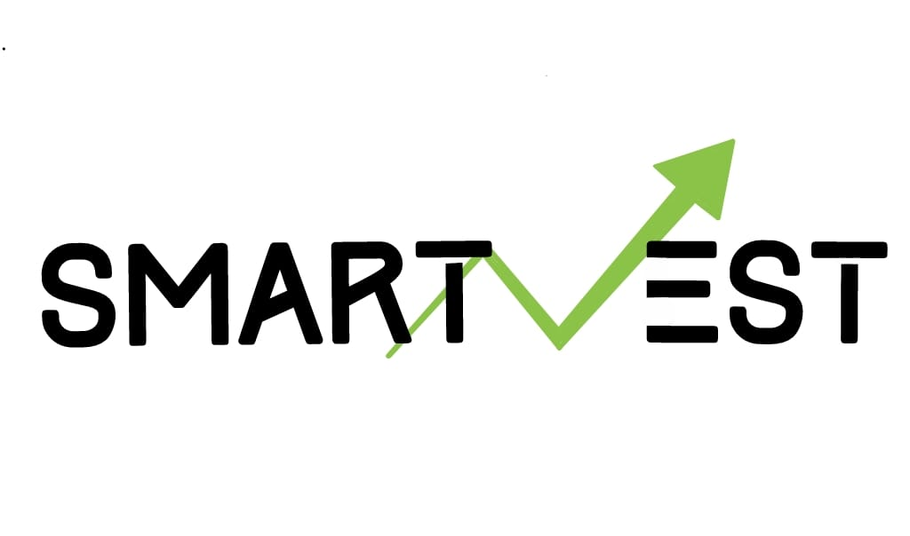

# SmartVest

<center></center>
SmartVest is a modern financial advisory platform designed to empower individual investors with AI-driven insights, real-time market data, and educational resources. It combines portfolio management tools, predictive analytics, sentiment analysis, and an interactive learning module to simplify investment decisions. The platform offers features like:

1.Real-time stock tracking

2.Personalized portfolio recommendations

3.Dynamic data visualization

4.Educational content to enhance financial literacy

Built as a web application, SmartVest bridges the gap between complex financial tools and everyday investors, making smart investing accessible to all.

# Setting up and running the project

1. Fork the repo and clone it
```
https://github.com/smartvest2025/Gitcapstone.git
```
2. Activate your virtual Python environment
3. To download the required packages run the commands below
```
pip install -r requirementsnew.txt
```
4. Download our sentiment analysis model from <a href='[https://drive.google.com/file/d/1vGN0481ovU6mQZkgKO2lLAGMKnXVbufi/view?usp=sharing](https://drive.google.com/file/d/1u4UnozW0tc36Brb41Ka_SNir-nEaNK04/view?usp=sharing)'>here</a> and place it inside the directory `Gitcapstone/basic_app/`

5. After the above setup, run the following commands
```
python manage.py migrate
python manage.py makemigrations basic_app
python manage.py migrate
```
6. To start the backend server run the following command
```
python manage.py runserver
```
7. Open your browser and navigate to the url below
```
http://localhost:8000
```


# Preview

Project Demo Video Link - https://drive.google.com/file/d/1_VMMaJuorQlay-BZHBlu-2KJMfMqu0Cz/view?usp=sharing

